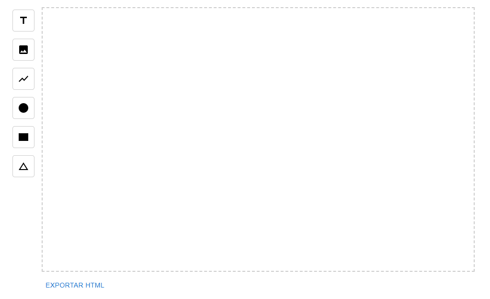

# React Templates DnD

A simple react library to create and export HTML templates using fabric.js and react-dnd.

# Installation

```bash
npm install react-templates-dnd
```

# Demo


# Basic Usage

```javascript
import TemplateCanvas from "react-templates-dnd";

const App: React.FC = () => {
  return (
    <div className="App">
      <TemplateCanvas />
    </div>
  );
};

export default App;
```

By using the TemplateCanvas component, you will be able to see the template editor in your project:


